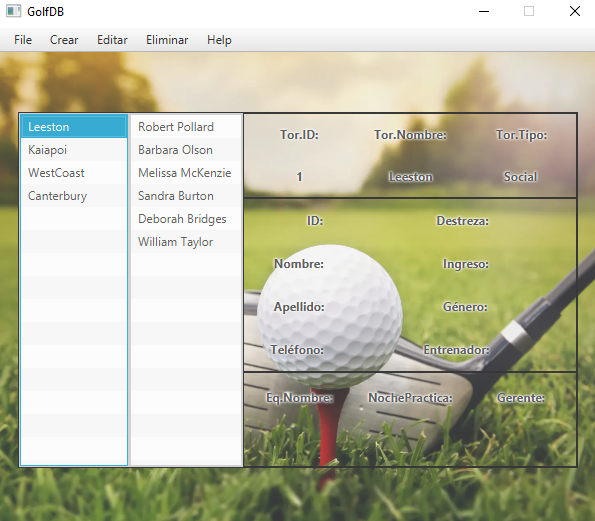
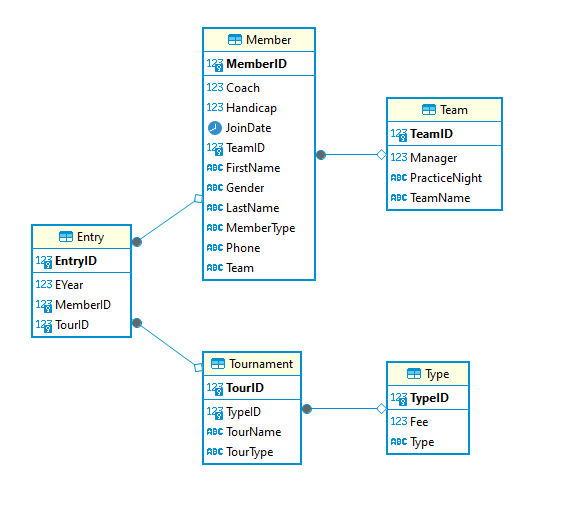
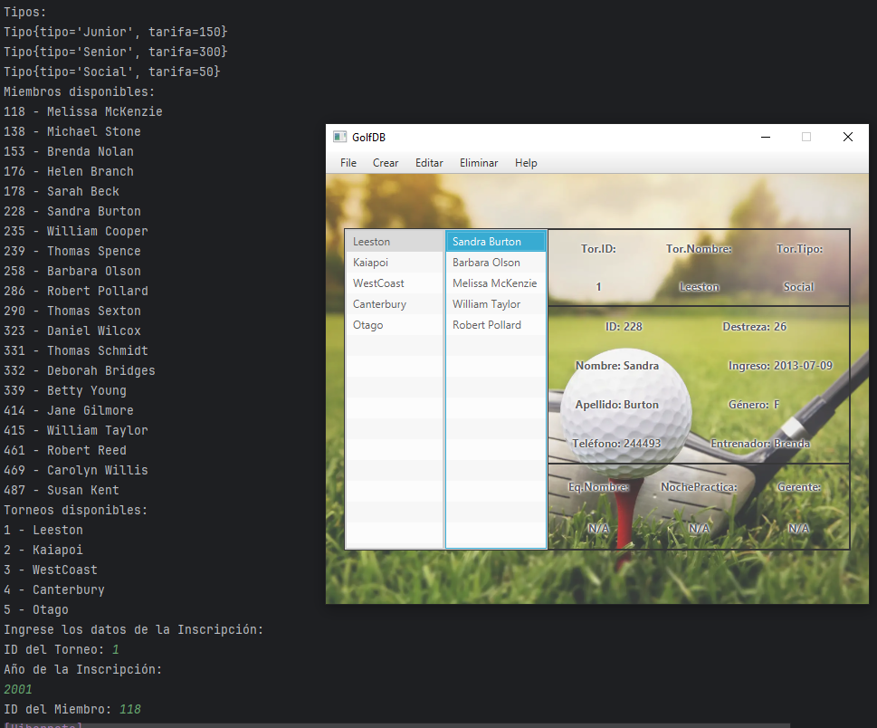
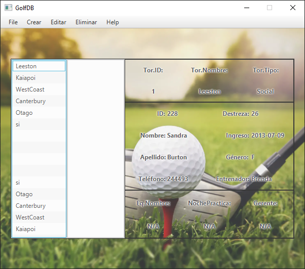

# [GolfDB-App](https://github.com/a22alanbm/Proyecto-ORM)

  

### Descripción del Proyecto

El proyecto se centra en el desarrollo de un programa especializado para la gestión integral de torneos y miembros de golf.

 Diseñado con un enfoque modular y orientado a la eficiencia en la manipulación de datos, la aplicación utiliza una base de datos para almacenar información relevante sobre distintos eventos, tipos de miembros, inscripciones y equipos relacionados con el mundo del golf.

La interfaz de usuario proporciona una experiencia amigable, permitiendo a los usuarios visualizar de manera intuitiva los datos almacenados en la base de datos. Sin embargo, dada la restricción de tiempo, parte de la gestión de datos se lleva a cabo mediante una interfaz de línea de comandos.

 A pesar de esta limitación inicial, se contempla la posibilidad de implementar una interfaz gráfica completa en el futuro, facilitando la creación, edición y eliminación de objetos de manera más accesible para los usuarios, pues por el momento es necesario el uso de linea de comandos.

  

### Funcionalidades
Tipo: Se refiere al tipo de torneo y está asociado a una tarifa.

Torneo: Contiene pocos datos que se muestran gráficamente.

Inscripcion: Maneja los datos de un miembro y un torneo. Es necesario crear una inscripción para que se muestren los miembros; de lo contrario, no se mostrarán gráficamente. Por lo tanto, es necesario crear primero el miembro y luego elegir un torneo para hacer una inscripción. Solo así se encontrará en pantalla.

Miembro: Contiene todos los datos necesarios que se muestran gráficamente.

Equipo: Contiene datos que se muestran gráficamente.

### Instalación
Esta parte importante queda a cargo del usuario, si usa el proyecto completo la base de datos debería estar correcta.

Pero si debe crear una base de datos, tendría que cambiar en el persistence.xml la ruta y tanto en ese caso como si está vacía deberá ejecutar en orden las inserciones de datos.

En el caso de que crees la base de datos, deberás ejecutar el programa para que este cree las tablas correctamente, tras ello, cierra el programa, ejecuta las sentencias sql y empieza a trabajar.

Esto en los casos de que quieras trabajar con los datos existentes, pero la aplicación se puede usar por completo sin estos datos, ya que son independientes, puedes crear los tuyos propios sin problema.

### Uso
Puedes utilizar la barra de tareas para crear, editar y eliminar por linea de comandos, o usar el click derecho para eliminar miembros y torneos de manera gráfica.

  

### Error
Un error minimo que no ha sido capaz de solucionarse es por culpa de jafafx, podrá percatarse que al crear un nuevo Torneo, javafx comete un error y se muestran datos adicionales erroneos al final de la lista.

  

