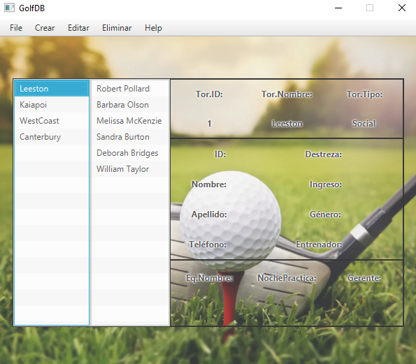
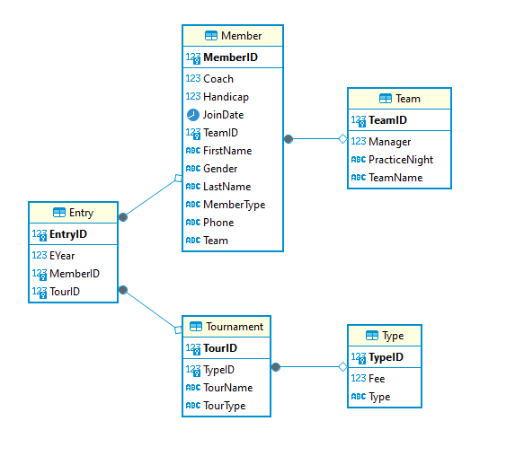

# Proyecto-ORM

    

Descripción del Proyecto

El proyecto se centra en el desarrollo de un programa especializado para la gestión integral de torneos y miembros de golf. Diseñado con un enfoque modular y orientado a la eficiencia en la manipulación de datos, la aplicación utiliza una base de datos para almacenar información relevante sobre distintos eventos, tipos de miembros, inscripciones y equipos relacionados con el mundo del golf.

La interfaz de usuario proporciona una experiencia amigable, permitiendo a los usuarios visualizar de manera intuitiva los datos almacenados en la base de datos. Sin embargo, dada la restricción de tiempo, parte de la gestión de datos se lleva a cabo mediante una interfaz de línea de comandos. A pesar de esta limitación inicial, se contempla la posibilidad de implementar una interfaz gráfica completa en el futuro, facilitando la creación, edición y eliminación de objetos de manera más accesible para los usuarios, pues por el momento es necesario el uso de linea de comandos.

  

